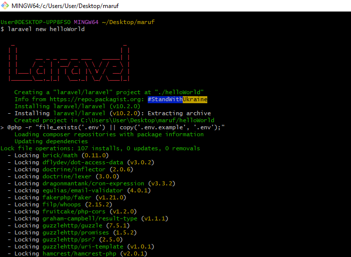
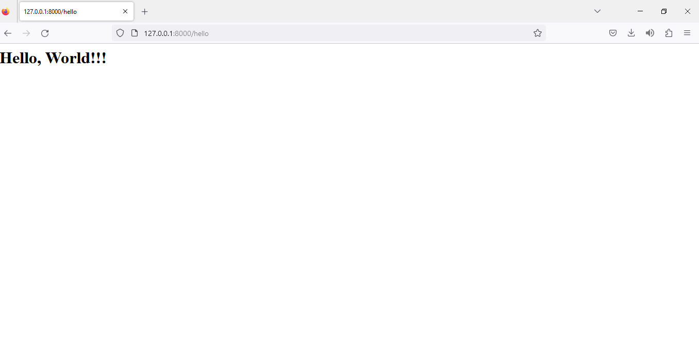
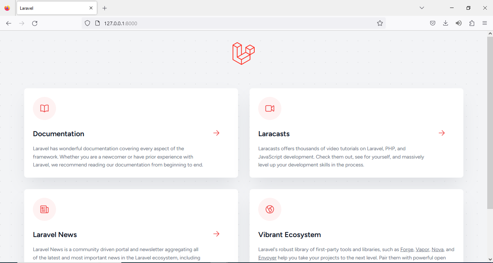

# laravel-starter
practice-session
## Screenshots






## Creating a new Laravel project

Start or create a new project on Laravel
```bash
  composer global require laravel/installer
```
```bash
laravel new helloWorld
``` 

```bash
cd helloWorld
 
php artisan serve
``` 
that's all to create a new laravel project
